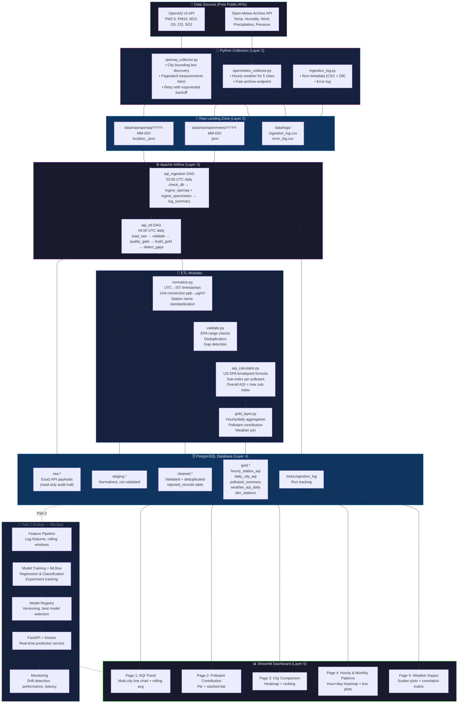

# AQI Pipeline — Architecture Diagram

## High-Level Architecture



---

## Layer Descriptions

| Layer | Technology | Purpose |
|---|---|---|
| **1. Source** | OpenAQ v3 API, Open-Meteo | Free public air quality and weather data |
| **2. Ingestion** | Python `requests`, `tenacity` | REST API collectors with retry/backoff |
| **3. Raw / Staging** | JSON files + PostgreSQL `raw.*` + `staging.*` | Immutable raw copies, normalized data |
| **4. Transformation** | ETL modules + Apache Airflow | Quality checks, AQI calculation, aggregation |
| **5. Storage** | PostgreSQL `cleaned.*` + `gold.*` | Validated, analysis-ready tables |
| **6. Analytics** | Streamlit + Plotly | Interactive 5-page dashboard |
| **7. MLOps (Part 2)** | MLflow, FastAPI, Docker | Model training, serving, and monitoring |

---

## Pipeline Flow (Sequential)

```
[02:00 UTC] aqi_ingestion DAG
    1. check_db_connection        → verify PostgreSQL reachable
    2. ingest_openaq (parallel)   → fetch & save raw JSON
       ingest_openmeteo           → fetch & save raw JSON
    3. log_ingestion_summary      → write to meta.ingestion_log

[04:00 UTC] aqi_etl DAG
    1. load_raw_to_staging        → normalize & load staging.*
    2. validate_and_clean         → quality checks → cleaned.*
    3. quality_gate               → fail if rejection rate > 20%
         ├── [pass] build_gold_layer → gold.* tables
         └── [fail] quality_gate_failed (alert)
    4. identify_data_gaps         → log missing periods
```

---

## Data Flow Diagram

```
Raw Record (OpenAQ JSON)
    │
    ▼ normalize.py
    │  - UTC → IST conversion
    │  - Station name: "anand vihar" → "Anand Vihar"
    │  - Unit: 45 ppb NO2 → 86.04 µg/m³
    ▼
staging.measurements
    │
    ▼ validate.py
    │  - Range check: 0 ≤ PM2.5 ≤ 1000 µg/m³
    │  - Dedup: (location_id, parameter, measured_at_utc)
    │  - Gap detection: flag gaps > 2 hours
    ▼
cleaned.air_quality
    │
    ▼ aqi_calculator.py
    │  - PM2.5 = 55.4 µg/m³ → sub-index = 100
    │  - PM10 = 154 µg/m³ → sub-index = 100
    │  - NO2 = 86 µg/m³ → sub-index = 43
    │  - Overall AQI = max(100, 100, 43, ...) = 100 → "Moderate"
    ▼
gold.hourly_station_aqi → gold.daily_city_aqi
                                   │
                    ┌──────────────┴──────────────┐
                    ▼                             ▼
         gold.pollutant_summary      gold.weather_aqi_daily
         (contribution %)            (joined with weather)
```
